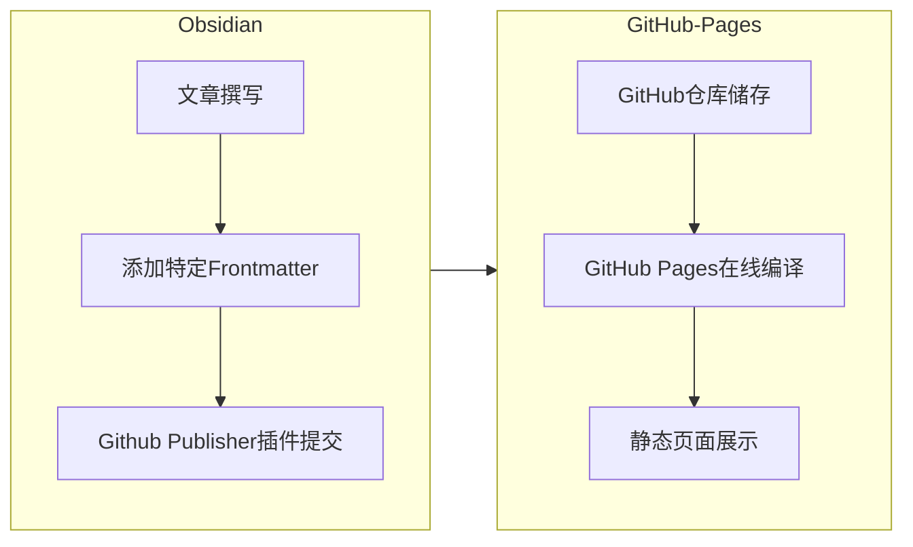

---
tags:
  - GTD/Source
Status: Doing
LatestKeyDate: 
Comments: 
share: true
title: 使用Obsidian+GitHub Pages部署在线博客
sharetitle: 2023-09-03-Build-Blog-Online
sharepath: doc
mermaid: true
---

# 使用Obsidian+GitHubPages部署在线博客
> 本方案可实现的功能包括：
> 1. 使用Obsidian进行内容创作，并且决定将哪些内容上传至博客中。
> 2. 使用GitHub Pages在线编译并发布博客内容。
> 3. 通过`https://username.github.io/repname/`访问搭建好的博客。

本方案的整体路线图如下图所示。



## 1. GitHub Pages设置

### 1.1 创建GitHub仓库并开启GitHub Pages

> 本方案在线部分使用GitHub仓库创建站点，在创建站点时亦可创建用户和组织站点。关于二者的说明可参考官方文档 [创建 GitHub Pages 站点 - GitHub 文档](https://docs.github.com/zh/pages/getting-started-with-github-pages/creating-a-github-pages-site)。

**Step1**：创建一个以你喜欢的名字命名的GitHub仓库，并 _将该仓库的可见性设置为Public_ （重要，根据GitHub当前要求，个人版的仓库需设置为Public才可以使用GitHub Pages，详见 [更改 GitHub Pages 站点的可见性 - GitHub Enterprise Cloud Docs](https://docs.github.com/zh/enterprise-cloud@latest/pages/getting-started-with-github-pages/changing-the-visibility-of-your-github-pages-site)）

**Step2**：打开仓库页面的“Settings”，在左侧选项卡中选择“Code and automation”卡组下的“Pages”，即可打开GitHub Pages的配置页面。

**Step3**：在“Build and deployment”部分的“Suorce”处选择GitHub Actions即可设置使用 GitHub Actions 工作流来发布站点，笔者使用了GitHub提供的入门工作流（GitHub Pages Jekyll）。有能力的朋友可选择自行编写 GitHub Actions 工作流或采用“从分支进行发布”，关于发布源的设置详见官方文档 [配置 GitHub Pages 站点的发布源 - GitHub 文档](https://docs.github.com/zh/pages/getting-started-with-github-pages/configuring-a-publishing-source-for-your-github-pages-site#publishing-with-a-custom-github-actions-workflow)

### 1.2 设置网页外观

**Step1**：在仓库的根目录创建一个`_config.yml`文件，该文件的作用是定制化静态网页的属性，例如网页主题、主页标题、主页说明等。其中网页主题可在Github上已有主题的基础上进行修改。此处给出笔者使用的`_config.yml`文件及相关可参考网页。

```yml
remote_theme: sighingnow/jekyll-gitbook
title: Leo's Homepage
description: Interesting thoughts share with the world

syntax_highlighter_style: pastie
toc:
    enabled: true
    h_min: 2
    h_max: 3
```

- 网页主题设置相关网页
	- [GitHub Pages官方支持的主题](https://pages.github.com/themes/)
	- [使用 Jekyll 向 GitHub Pages 站点添加主题 - GitHub 文档](https://docs.github.com/zh/pages/setting-up-a-github-pages-site-with-jekyll/adding-a-theme-to-your-github-pages-site-using-jekyll)
	- [代码高亮语法主题 (mazhuang.org)](https://mazhuang.org/rouge-themes/#colorful)
	- 笔者使用的网页主题：[sighingnow/jekyll-gitbook: Build Jekyll site with GitBook style! (github.com)](https://github.com/sighingnow/jekyll-gitbook)


## 2. Obsidian设置
### 2.1 GitHub Publisher插件设置

> GitHub Publisher插件可将Obsidian中的指定笔记上传到指定的Github仓库中。该插件可直接在Obsidian插件市场下载。   
> GitHub Publisher插件的Github仓库：https://github.com/ObsidianPublisher/obsidian-github-publisher    
> GitHub Publisher插件的官方文档：https://obsidian-publisher.netlify.app/plugin/

**Step1**：获取创建好的Github仓库的Token，具体方法可参考 [Fine grained access token (ole.dev)](https://dg-docs.ole.dev/advanced/fine-grained-access-token/)

**Step2**：将Github仓库的信息填入GIthub Publisher插件“GitHub Configuration”页面的相应位置。

**Step3**：在“Upload configuration”页面设置上传文件的相关设置。需要注意的是，此处与“2.2 Frontmatter设置”有联动，笔者在此给出主要设置的功能说明，并给出笔者自己的设置以供参考。

| 设置名称 | 主要功能 | 笔者设置值（仅供参考） | 笔者设置说明 |
|---|---|---|---|
| File tree in repository | 此处设置文件在GitHub仓库中的储存目录 | Properties key | 根据Frontmatter中的属性设置储存位置 |
| Default Folder | 默认储存位置 | （留空） | 当Frontmatter中不包含储存路径的key时文档会被储存至仓库根目录（用于储存主页） |
| Properties key | Frontmatter中设置储存路径的key | sharepath | 插件会读取sharepath下的路径来储存文档 |
| Root folder | 文档储存根目录 | \_posts | 以仓库中的“\_posts”文件夹为储存的根目录 |
| Set the key where to get the value of the filename | 储存至GitHub仓库时所用的文件名 | sharetitle | 插件会读取sharetitle下的名称作为文件名 |

注：关于“Default Folder”、“Root folder”的区别详见插件官方文档的示例 [Filepath example (obsidian-publisher.netlify.app)](https://obsidian-publisher.netlify.app/plugin/example/filepath_example/)。

**Step4**：在“Text&links”页面进行文档内容的格式化设置，主要为链接、Dataview、Tags等的转换。笔者打开了“Links”下的所有开关选项，以便将Obsidian中的Wiki-link转换成在线编译时可识别的Markdown-link。

### 2.2 Frontmatter设置

Frontmatter的设置用于配合GitHub Publisher插件指定需要上传的文件以及定制化上传文件的某些属性。笔者设置的Frontmatter及其用途如下。

| Properties key | 用途 |
|---|---|
| share | 用于标识该文件是否需要上传，需要上传时为`true`。 |
| title | 在网页中显示的文章标题 |
| sharetitle | 储存在GitHub仓库中的文件标题 |
| sharepath | 储存在GitHub仓库中的路径 |
| mermaid | 与本文所用Theme联动，表示本文中包含mermaid流程图 |

以本文为例，本文的上述Properties key设置如下：

```yml
share: true
title: 使用Obsidian+GitHub Pages部署在线博客
sharetitle: 2023-09-03-Build-Blog-Online
sharepath: doc
mermaid: true
```

- 注1：在上述示例中，文档的储存位置为（配合1.1节中GitHub Publisher的设置）：`(root)/_posts/doc`。
- _注2（重要）_：在GitHub仓库中储存时，文件名需为`YYYY-MM-DD-Title`的形式，这样才可以被Jekyll编译成功。
- 注3：可使用Templater插件设置模板实现对文件标题（title）及文件名中日期的自动添加。笔者使用的Templater模板如下：

```yml
share: 
title: <% tp.file.title %>
sharetitle: <% tp.date.now(f="YYYY-MM-DD") %>
sharepath:
mermaid: true
```


### 2.3 主页设置

Jekyll编译时使用位于仓库根目录下的`index.html`、`index.md`、`Readme.md`作为网页入口，因此需要设置一个主页才可以编译成功。同时，该主页也可作为博客的索引页和整体展示页使用。

笔者使用主页的Frontmatter设置如下：

```yml
share: true
sharetitle: index
```

注：由于主页的Frontmatter中不包含`sharepath`属性，因此会被储存至“Default Folder”中，配合GitHub Publisher的设置可将该文档放置在仓库根目录。

### 2.4 一些特殊的设置

#### 使网页中的Markdown链接显示为自己定义的文字

笔者在使用过程中发现，GitHub Publisher 将Wiki-link转换为Markdown-link后，链接的文字部分显示的是Frontmatter中`sharetitle`的内容，为了保证顺利实现在线编译，笔者的`sharetitle`设置为了带连字符的英语，且文件名中带有时间，不甚美观。为了使链接文字显示为自定义的文字，对Obsidian文档及GitHub Publisher 插件做如下设置。

Step1：在使用Wiki-link链接Obsidian中的文档时，为链接设置别名（别名可设置为任何想显示的文字），即`[Alias](Doc%20Name.md)`。

Step2：打开GitHub Publisher 插件的“Text&links”页面，在“Main Text”下的“Text replacer”中增加一项

| 待替换内容 | 替换后内容 | 备注 |
|---|---|---|
| `/(\[.*?\]\(.*?).md#(.*?\))/gm` | `$1.md$2` | 最右侧的箭头需要指向下 |

注1：上述设置为正则表达式，其含义为将Markdown链接中`.md#`中的`#`删除。正则表达式的用法可参考 [Regular expressions (javascript.info)](https://javascript.info/regular-expressions)

注2：此处设置参考了GitHub Publisher 插件的一个Issue：[[Plugin][FR]: Remove .md extension from generated links · Issue #176 · ObsidianPublisher/obsidian-github-publisher](https://github.com/ObsidianPublisher/obsidian-github-publisher/issues/176)

---
## 致谢

- 感谢 [Obsidian Mkdocs Publisher](https://github.com/ObsidianPublisher) 开发的GitHub Publisher插件。
- 感谢 [sighingnow (Tao He)](https://github.com/sighingnow) 的网页主题。
- 感谢[mzlogin (Zhuang Ma)](https://github.com/mzlogin)的[GitHub Pages 博客模板](https://github.com/mzlogin/mzlogin.github.io/tree/master)。
- 最初的灵感来自于 [Digital Garden](https://dg-docs.ole.dev/)， 部分设置亦是参考了Digital Garden，在此感谢。
- 本文功能实现过程中参考了诸多教程、经验及各类模板，在此一并感谢无私奉献的开源社区创作者。